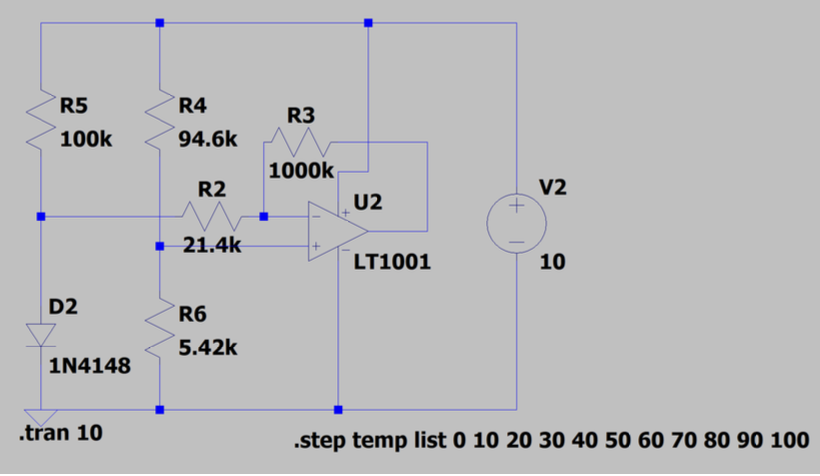

# Electronics1-Temperature-Project
# Analog Thermometer Project

This repository contains the design, calculations, and simulation of an analog thermometer circuit for the Electronics course at Sharif University of Technology.

## Team Members
* Vahid Hamzeh
* Amirali Fazeli

## Overview
This project features the design of a thermometer circuit using a diode that is capable of measuring ambient temperature in the range of $0^{\circ}C$ to $100^{\circ}C$. Because the voltmeter used for measurement operates within a $0V$ to $10V$ range, the circuit utilizes a $10V$ ($V_{cc}$) power supply to match this exact scale. 

### Circuit Schematic

## Theory and Calculations
The primary temperature sensor in this design is a diode. The underlying principle is that the diode's forward voltage drop changes by approximately $2mV$ for every $1^{\circ}C$ change in temperature. Therefore, across a $100^{\circ}C$ range, the voltage drop varies by about $200mV$. 

To achieve the desired $10V$ output variation for the voltmeter, an Operational Amplifier (Op-Amp) with a gain of $50$ is required. Furthermore, since the voltage change is negative as the temperature rises, an inverting amplifier configuration is implemented.

The governing equations for the design are as follows:
* $\Delta V_{D}/\Delta T \approx -2mV/^{\circ}C$
* $V_{VM}(100^{\circ}C) = 10V$
* $\Rightarrow A_{V} = -50$

### Offset Adjustment
At $0^{\circ}C$, the voltage drop across the diode is approximately $0.7V$. This baseline voltage must be subtracted from the amplifier's input to ensure the output reads $0V$ at zero degrees. This reduction is achieved using a voltage divider network consisting of resistors R4 and R6.

### Final Component Values
In practice, assuming a baseline voltage ($V_{don}$) of $0.542V$, the resistor values were designed to be adjustable. The selected component values are:
* $V_{don}=0.542V \Rightarrow R6=5.42k\Omega, R5=100k\Omega$
* $\Rightarrow R4=94.6k\Omega, R2=21.4k\Omega$
* $R3=1M\Omega$

*(Note: These resistor values were specifically chosen to ensure that the variations in diode current remain minimal during operation.)*

## Software Simulation
To verify and calibrate the circuit's performance, the following analyses were conducted:
1. **Diode Characteristics Extraction:** The `1N4148` diode was analyzed using `PSpice` software and its datasheet graphs to determine the exact forward voltage at various temperatures.
2. **Temperature Sweep Analysis:** Using the `.step temp list` command and the `Sample Temp` tool in `LTSpice`, the circuit was simulated at temperatures of $0, 10, 20, 30, 40, 50, 60, 70, 80, 90,$ and $100^{\circ}C$. The simulation results confirmed that the circuit achieves an accurate temperature scaling with an allowable error margin of $5\%$.
